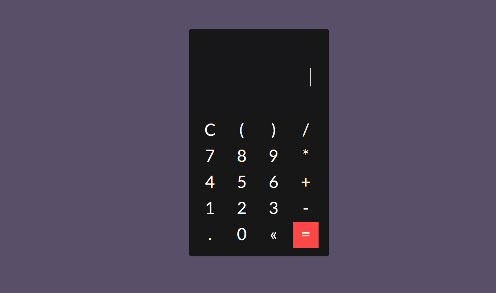

## :heavy_division_sign: Calculadora-JS

## :pushpin:Sobre

Calculadora criada utilizando Javascript.




## :closed_book:Tecnologias

* HTML
* CSS
* Javscript
## :pencil:Instalação

Clonar o repositório abaixo:
```
$ git clone git@github.com:jotapgn/Calculadora-JS.git
```
## :pencil:Como Executar
```
Execute o arquivo index.html com o navegador de sua preferência
